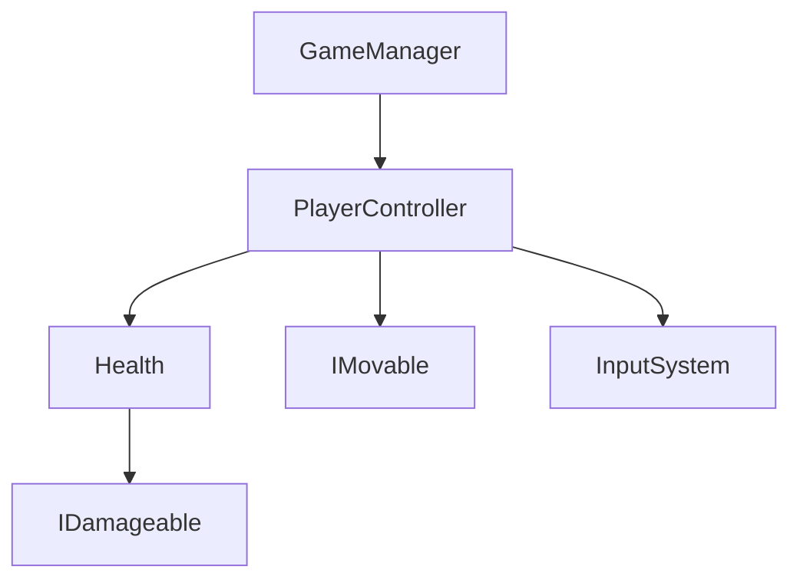

# 関係性グラフ機能 実装計画書

## 概要

Unity-AI-Forgeに3種類の関係性グラフを取得・可視化する機能を追加する。

### 対象となる関係性

1. **クラス間の関係性** - スクリプト/コンポーネント間の依存関係
2. **シーン内オブジェクトの参照関係** - GameObject/Component間の参照
3. **シーン同士の関係性** - シーン間の遷移・依存関係

---

## 1. クラス間の関係性グラフ (Class Dependency Graph)

### 機能概要
プロジェクト内のC#スクリプト間の依存関係を解析し、グラフ形式で出力する。

### 解析対象
- `using`ディレクティブによる名前空間依存
- フィールド/プロパティの型参照
- メソッドパラメータ・戻り値の型参照
- 継承関係（基底クラス、インターフェース）
- `[RequireComponent]`属性による依存

### 出力形式
```json
{
  "graphType": "classDependency",
  "nodes": [
    {
      "id": "MyNamespace.PlayerController",
      "type": "MonoBehaviour",
      "filePath": "Assets/Scripts/Player/PlayerController.cs",
      "assembly": "Assembly-CSharp"
    }
  ],
  "edges": [
    {
      "source": "MyNamespace.PlayerController",
      "target": "MyNamespace.Health",
      "relation": "field_reference",
      "details": "private Health _health"
    },
    {
      "source": "MyNamespace.PlayerController",
      "target": "MyNamespace.IMovable",
      "relation": "implements"
    }
  ]
}
```

### オペレーション
| Operation | 説明 |
|-----------|------|
| `analyzeClass` | 単一クラスの依存関係を解析 |
| `analyzeAssembly` | アセンブリ全体の依存関係を解析 |
| `analyzeNamespace` | 名前空間内の依存関係を解析 |
| `findDependents` | 指定クラスに依存しているクラスを検索 |
| `findDependencies` | 指定クラスが依存しているクラスを検索 |

---

## 2. シーン内オブジェクト参照グラフ (Scene Reference Graph)

### 機能概要
アクティブシーン（または指定シーン）内のGameObject/Component間の参照関係を解析する。

### 解析対象
- コンポーネントのSerializedFieldによるGameObject/Component参照
- UnityEventに登録されたリスナー参照
- 親子階層関係
- プレハブインスタンスとプレハブアセットの関係

### 出力形式
```json
{
  "graphType": "sceneReference",
  "scenePath": "Assets/Scenes/MainGame.unity",
  "nodes": [
    {
      "id": "Player",
      "path": "/Player",
      "instanceId": 12345,
      "components": ["Transform", "PlayerController", "Health"],
      "isPrefabInstance": true,
      "prefabAsset": "Assets/Prefabs/Player.prefab"
    }
  ],
  "edges": [
    {
      "source": "/Player",
      "target": "/GameManager",
      "relation": "component_reference",
      "sourceComponent": "PlayerController",
      "sourceField": "gameManager"
    },
    {
      "source": "/Canvas/HealthBar",
      "target": "/Player",
      "relation": "unity_event",
      "eventName": "OnHealthChanged"
    },
    {
      "source": "/Player",
      "target": "/Player/Weapon",
      "relation": "hierarchy_child"
    }
  ]
}
```

### オペレーション
| Operation | 説明 |
|-----------|------|
| `analyzeScene` | シーン全体の参照関係を解析 |
| `analyzeObject` | 特定GameObjectの参照関係を解析 |
| `findReferencesTo` | 指定オブジェクトを参照しているオブジェクトを検索 |
| `findReferencesFrom` | 指定オブジェクトが参照しているオブジェクトを検索 |
| `findOrphans` | 参照されていないオブジェクトを検索 |

---

## 3. シーン間関係性グラフ (Scene Relationship Graph)

### 機能概要
プロジェクト内のシーン間の関係性（遷移、依存）を解析する。

### 解析対象
- Build Settingsに登録されたシーン順序
- `SceneManager.LoadScene`呼び出しによる遷移関係
- GameKitSceneFlowによる遷移定義
- Addressables/AssetBundleによるシーン参照
- 共有プレハブ/アセットによる間接的依存

### 出力形式
```json
{
  "graphType": "sceneRelationship",
  "nodes": [
    {
      "id": "Assets/Scenes/MainMenu.unity",
      "name": "MainMenu",
      "buildIndex": 0,
      "inBuildSettings": true,
      "isAddressable": false
    }
  ],
  "edges": [
    {
      "source": "Assets/Scenes/MainMenu.unity",
      "target": "Assets/Scenes/GamePlay.unity",
      "relation": "scene_load",
      "loadType": "single",
      "callerScript": "Assets/Scripts/UI/MainMenuController.cs",
      "callerLine": 42
    },
    {
      "source": "Assets/Scenes/GamePlay.unity",
      "target": "Assets/Scenes/PauseMenu.unity",
      "relation": "scene_load",
      "loadType": "additive"
    },
    {
      "source": "Assets/Scenes/GamePlay.unity",
      "target": "Assets/Scenes/GameOver.unity",
      "relation": "sceneflow_transition",
      "flowAsset": "Assets/SceneFlows/MainFlow.asset"
    }
  ],
  "buildOrder": [
    "Assets/Scenes/MainMenu.unity",
    "Assets/Scenes/GamePlay.unity",
    "Assets/Scenes/GameOver.unity"
  ]
}
```

### オペレーション
| Operation | 説明 |
|-----------|------|
| `analyzeAll` | プロジェクト全体のシーン関係を解析 |
| `analyzeScene` | 特定シーンからの遷移先を解析 |
| `findTransitionsTo` | 指定シーンへ遷移するシーンを検索 |
| `findTransitionsFrom` | 指定シーンから遷移するシーンを検索 |
| `validateBuildSettings` | Build Settings登録状態の検証 |

---

## 実装アーキテクチャ

### ファイル構成

```
Assets/UnityAIForge/Editor/MCPBridge/
├── Handlers/
│   └── HighLevel/                          # 新規ディレクトリ
│       ├── ClassDependencyGraphHandler.cs  # クラス依存関係ハンドラー
│       ├── SceneReferenceGraphHandler.cs   # シーン内参照ハンドラー
│       └── SceneRelationshipGraphHandler.cs # シーン間関係ハンドラー
├── Utilities/
│   └── GraphAnalysis/                      # 新規ディレクトリ
│       ├── ClassDependencyAnalyzer.cs      # クラス解析ロジック
│       ├── SceneReferenceAnalyzer.cs       # シーン参照解析ロジック
│       ├── SceneRelationshipAnalyzer.cs    # シーン関係解析ロジック
│       ├── GraphNode.cs                    # グラフノードモデル
│       ├── GraphEdge.cs                    # グラフエッジモデル
│       └── GraphResult.cs                  # 解析結果モデル
└── Base/
    └── CommandHandlerInitializer.cs        # 既存（ハンドラー登録追加）

Assets/UnityAIForge/MCPServer/src/tools/
└── register_tools.py                       # 既存（ツール定義追加）
```

### ハンドラー設計

#### 1. ClassDependencyGraphHandler

```csharp
public class ClassDependencyGraphHandler : BaseCommandHandler
{
    public override string Category => "classDependencyGraph";

    public override IEnumerable<string> SupportedOperations => new[]
    {
        "analyzeClass",
        "analyzeAssembly",
        "analyzeNamespace",
        "findDependents",
        "findDependencies"
    };
}
```

#### 2. SceneReferenceGraphHandler

```csharp
public class SceneReferenceGraphHandler : BaseCommandHandler
{
    public override string Category => "sceneReferenceGraph";

    public override IEnumerable<string> SupportedOperations => new[]
    {
        "analyzeScene",
        "analyzeObject",
        "findReferencesTo",
        "findReferencesFrom",
        "findOrphans"
    };
}
```

#### 3. SceneRelationshipGraphHandler

```csharp
public class SceneRelationshipGraphHandler : BaseCommandHandler
{
    public override string Category => "sceneRelationshipGraph";

    public override IEnumerable<string> SupportedOperations => new[]
    {
        "analyzeAll",
        "analyzeScene",
        "findTransitionsTo",
        "findTransitionsFrom",
        "validateBuildSettings"
    };
}
```

### Python MCP ツール定義

```python
# unity_class_dependency_graph
types.Tool(
    name="unity_class_dependency_graph",
    description="Analyze class/script dependency relationships in the Unity project",
    inputSchema={
        "type": "object",
        "properties": {
            "operation": {
                "type": "string",
                "enum": ["analyzeClass", "analyzeAssembly", "analyzeNamespace",
                         "findDependents", "findDependencies"]
            },
            "target": {"type": "string"},  # クラス名/アセンブリ名/名前空間
            "depth": {"type": "integer", "default": 1},  # 解析深度
            "includeUnityTypes": {"type": "boolean", "default": False}
        },
        "required": ["operation"]
    }
)

# unity_scene_reference_graph
types.Tool(
    name="unity_scene_reference_graph",
    description="Analyze object reference relationships within a Unity scene",
    inputSchema={
        "type": "object",
        "properties": {
            "operation": {
                "type": "string",
                "enum": ["analyzeScene", "analyzeObject", "findReferencesTo",
                         "findReferencesFrom", "findOrphans"]
            },
            "scenePath": {"type": "string"},
            "objectPath": {"type": "string"},
            "includeHierarchy": {"type": "boolean", "default": True},
            "includeEvents": {"type": "boolean", "default": True}
        },
        "required": ["operation"]
    }
)

# unity_scene_relationship_graph
types.Tool(
    name="unity_scene_relationship_graph",
    description="Analyze relationships between Unity scenes",
    inputSchema={
        "type": "object",
        "properties": {
            "operation": {
                "type": "string",
                "enum": ["analyzeAll", "analyzeScene", "findTransitionsTo",
                         "findTransitionsFrom", "validateBuildSettings"]
            },
            "scenePath": {"type": "string"},
            "includeScriptReferences": {"type": "boolean", "default": True},
            "includeSceneFlow": {"type": "boolean", "default": True}
        },
        "required": ["operation"]
    }
)
```

---

## 技術的考慮事項

### パフォーマンス最適化

1. **キャッシュ機構**: 解析結果をEditorPrefsまたはメモリにキャッシュ
2. **増分解析**: 変更されたファイルのみ再解析
3. **非同期処理**: 大規模プロジェクトでのUI応答性確保
4. **深度制限**: `depth`パラメータで解析範囲を制限

### Unity API活用

| 解析対象 | 使用するUnity API |
|---------|------------------|
| クラス依存関係 | `MonoScript`, `AssetDatabase`, Mono.Cecil (リフレクション) |
| シーン内参照 | `SerializedObject`, `SerializedProperty`, `PrefabUtility` |
| シーン間関係 | `EditorBuildSettings`, `AssetDatabase.GetDependencies` |
| UnityEvent解析 | `UnityEventBase`, `SerializedProperty` |

### エラーハンドリング

- 存在しないシーン/オブジェクトの指定
- コンパイルエラー中のクラス解析
- 循環参照の検出と報告
- 大規模グラフの出力制限

---

## 実装フェーズ

### Phase 1: 基盤構築
- [ ] グラフモデルクラス（GraphNode, GraphEdge, GraphResult）
- [ ] 基本的なAnalyzerインターフェース

### Phase 2: シーン内参照グラフ
- [ ] SceneReferenceAnalyzer実装
- [ ] SceneReferenceGraphHandler実装
- [ ] Pythonツール定義追加

### Phase 3: クラス依存関係グラフ
- [ ] ClassDependencyAnalyzer実装
- [ ] ClassDependencyGraphHandler実装
- [ ] Pythonツール定義追加

### Phase 4: シーン間関係グラフ
- [ ] SceneRelationshipAnalyzer実装
- [ ] SceneRelationshipGraphHandler実装
- [ ] Pythonツール定義追加

### Phase 5: 統合・最適化
- [ ] キャッシュ機構の実装
- [ ] パフォーマンステスト
- [ ] ドキュメント作成

---

## 出力フォーマットオプション

各ハンドラーは以下の出力形式をサポートする予定：

| Format | 説明 | 用途 |
|--------|------|------|
| `json` | 構造化JSONデータ（デフォルト） | プログラム処理、AI解析 |
| `dot` | Graphviz DOT形式 | グラフ可視化ツール連携 |
| `mermaid` | Mermaid記法 | Markdown埋め込み |
| `summary` | テキストサマリー | 簡易確認 |

### 出力例（Mermaid形式）



---

## 関連ファイル

- 既存ハンドラー例: `Assets/UnityAIForge/Editor/MCPBridge/Handlers/GameKit/`
- 登録処理: `Assets/UnityAIForge/Editor/MCPBridge/Base/CommandHandlerInitializer.cs`
- Pythonツール: `Assets/UnityAIForge/MCPServer/src/tools/register_tools.py`

---

*作成日: 2026-02-01*
*ステータス: 計画段階*
