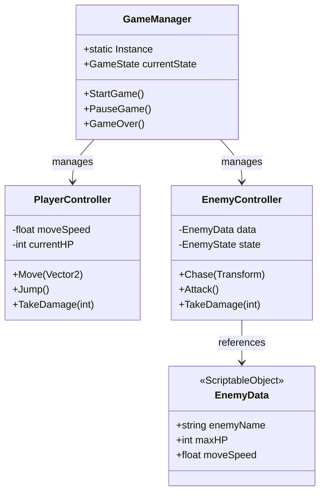
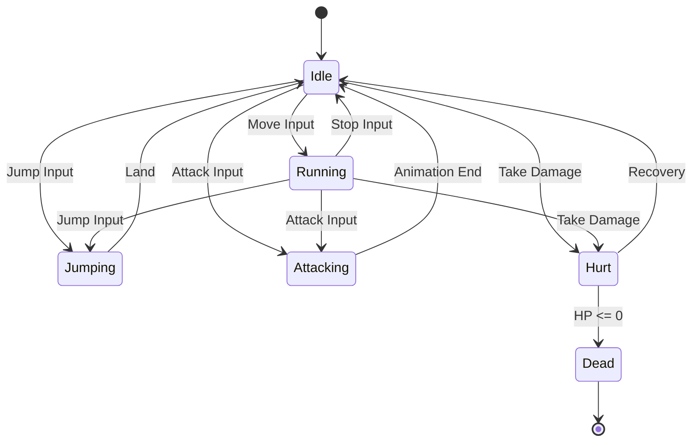
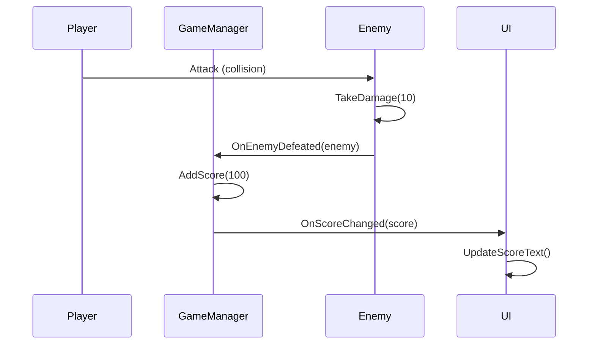
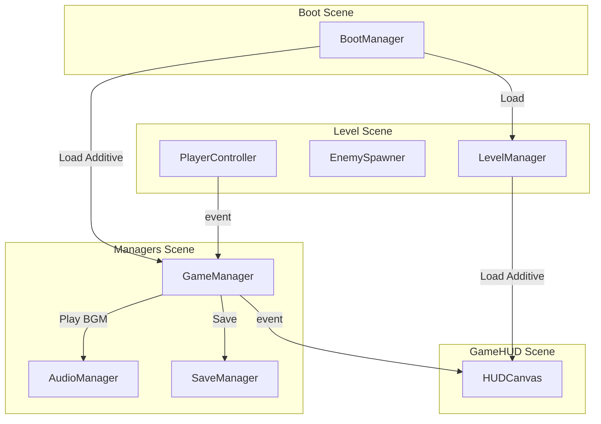
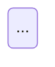

# 設計 ワークフローガイド (Unity-AI-Forge v{VERSION})

デザインパターン選定とUML設計。企画書の要件を技術設計に落とし込み、クラス構造・状態遷移・シーケンスを明確にするためのガイドです。

---

## 概要

設計フェーズの目的は「どう作るか」を技術的に明確にすることです。企画書で定義したメカニクス・シーン構成をもとに、適切なデザインパターンを選定し、UML図でクラス構造・状態遷移・通信フローを設計します。ここでの設計がプロトタイプ以降のコード品質を決定します。

**設計フェーズの原則:**
- 企画書のメカニクス一覧をもとにパターンを選定する
- Unity の特性（コンポーネント指向・SerializeField・ScriptableObject）を活かす
- 過度な抽象化を避け、必要最小限の設計にとどめる
- Mermaid 形式で UML を書き、プロジェクト内に保存する
- `class_dependency_graph` の概念を事前設計に反映する

---

## パイプライン位置

```
企画 → [設計] → プロジェクト初期設定 → プロトタイプ → アルファ → ベータ → リリース
```

---

## Unity 向け推奨デザインパターン

### Singleton (マネージャー系)

ゲーム全体で1つだけ存在するマネージャーに使用。`DontDestroyOnLoad` と併用。

```csharp
// GameManager, AudioManager, InputManager 等
public class GameManager : MonoBehaviour
{
    public static GameManager Instance { get; private set; }
    void Awake()
    {
        if (Instance != null) { Destroy(gameObject); return; }
        Instance = this;
        DontDestroyOnLoad(gameObject);
    }
}
```

**使いどころ**: GameManager, AudioManager, SaveManager
**注意**: 乱用するとグローバル状態が増えてテスト困難になる。本当に1つで良いものだけに使用。

### State Machine (状態遷移)

プレイヤー・敵・UI の状態管理に使用。

```csharp
// enum + switch / インターフェース + クラス のどちらでも可
public enum PlayerState { Idle, Running, Jumping, Attacking, Hurt, Dead }
```

**使いどころ**: PlayerController, EnemyAI, GameFlow, UIScreen遷移
**詳細**: `game_mechanics_guide(mechanic='state_machine')`

### Observer / Event (イベント駆動)

コンポーネント間の疎結合な通信に使用。C# の `event` / `Action` / Unity の `UnityEvent`。

```csharp
// C# event パターン
public static event Action<int> OnScoreChanged;
public static event Action<float> OnHealthChanged;

// Unity の UnityEvent はインスペクタからwiring可能
// → unity_event_wiring ツールで接続
```

**使いどころ**: HP変化通知, スコア更新, ゲーム状態変化, UI更新トリガー

### Command (コマンド)

入力→実行を分離。Undo/Redo、リプレイ、AIの行動キューに使用。

```csharp
public interface ICommand
{
    void Execute();
    void Undo();
}
```

**使いどころ**: ターン制RPGの行動選択, エディタツール, Undo機能

### Object Pool (オブジェクトプール)

頻繁に生成・破棄されるオブジェクト（弾, エフェクト）のGC負荷軽減。

```csharp
// GameKit VFX はプーリング内蔵
// unity_gamekit_vfx(usePooling=True, poolSize=20)
```

**使いどころ**: 弾, VFXパーティクル, 敵の大量スポーン
**備考**: `unity_gamekit_vfx` はプーリング機能を内蔵しているため、VFX用途では自前実装不要。

### ScriptableObject (データ駆動)

ゲームデータをコードから分離。バランス調整・アセット管理に活用。

```csharp
[CreateAssetMenu(menuName = "MyGame/EnemyData")]
public class EnemyData : ScriptableObject
{
    public string enemyName;
    public int maxHP;
    public float moveSpeed;
    public float attackDamage;
}
```

**使いどころ**: 敵パラメータ, アイテムデータ, スキルテーブル, ゲーム設定
**MCPツール**: `unity_scriptableObject_crud(operation='create')`

### MVC/MVP for UI

UI とゲームロジックを分離する。Model(データ) - View(表示) - Controller/Presenter(仲介)。

```
Model (ScriptableObject/C# class) ← データ保持
  ↕ event通知
Presenter (MonoBehaviour) ← ロジック・仲介
  ↕ UI更新
View (UGUI/UI Toolkit) ← 表示のみ
```

**使いどころ**: HUD, インベントリ画面, ショップ画面
**MCPツール**: `unity_gamekit_ui_binding` がModel→View方向のバインディングを提供。

---

## Mermaid UML 設計ガイド

設計書はMermaid形式で記述し、プロジェクト内に保存します。

### クラス図



### ステート図



### シーケンス図



### コンポーネント図



---

## 設計ドキュメントの保存

```python
# クラス図を含む設計ドキュメントを保存
unity_asset_crud(operation='create',
    assetPath='Assets/Documents/ClassDiagram.md',
    content='''# クラス設計

## クラス図
```mermaid
classDiagram
    ...
```

## 状態遷移図

''')
```

---

## Unity 標準パッケージ選定ガイド

プロジェクトで使用するパッケージを設計段階で決定します。

| パッケージ | 用途 | 推奨条件 |
|-----------|------|---------|
| Input System | 入力管理 | 全プロジェクトで推奨 |
| TextMeshPro | テキスト描画 | 全プロジェクトで推奨 |
| Cinemachine | カメラ制御 | 3D / 複雑なカメラワーク |
| 2D Tilemap | タイルマップ | 2Dゲーム |
| 2D Animation | ボーンアニメーション | 2Dキャラクター |
| Addressables | アセット管理 | 大規模プロジェクト |
| Universal RP | レンダリング | 2D/3Dマルチ、モバイル |

---

## チェックリスト

### パターン選定
- [ ] 企画書のメカニクス一覧から必要なパターンを特定した
- [ ] Singleton を使うマネージャーを列挙した
- [ ] State Machine で管理する対象を列挙した
- [ ] イベント（Observer）で通知する変化を列挙した
- [ ] ScriptableObject で管理するデータを列挙した

### UML図
- [ ] クラス図を作成した（主要クラスとその関係）
- [ ] ステート図を作成した（プレイヤー/敵/ゲーム状態）
- [ ] シーケンス図を作成した（主要なインタラクション）
- [ ] コンポーネント図を作成した（シーン間関係）

### パッケージ
- [ ] 使用するUnityパッケージを決定した
- [ ] パッケージの依存関係を確認した

### ドキュメント
- [ ] 設計ドキュメントをプロジェクト内に保存した
- [ ] 企画書との対応関係を明記した

---

## 次のフェーズへ

設計が完了したら、以下の順序で進みます:

1. **プロジェクト初期設定** (`game_workflow_guide(phase='project_setup')`) - タグ・レイヤー・フォルダ構造の実装
2. **プロトタイプ** (`game_workflow_guide(phase='prototype')`) - コアループの動作検証

設計で定義したクラス構造は、プロトタイプでは簡易版として実装し、アルファで正式なアーキテクチャに昇格させます。

---

## 関連ツール一覧

| ツール | 設計フェーズでの用途 |
|--------|-------------------|
| `unity_asset_crud` | 設計ドキュメントの保存 |
| `unity_class_dependency_graph` | 既存コードの依存関係調査（リファクタリング時） |
| `unity_class_catalog` | 既存クラスの一覧確認 |
| `game_genre_guide` | ジャンル別推奨パターンの参照 |
| `game_mechanics_guide` | メカニクス実装パターンの参照 |
