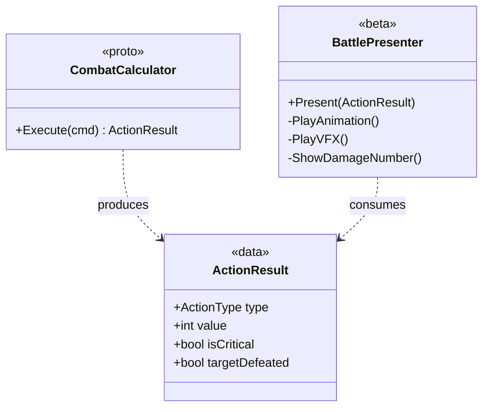
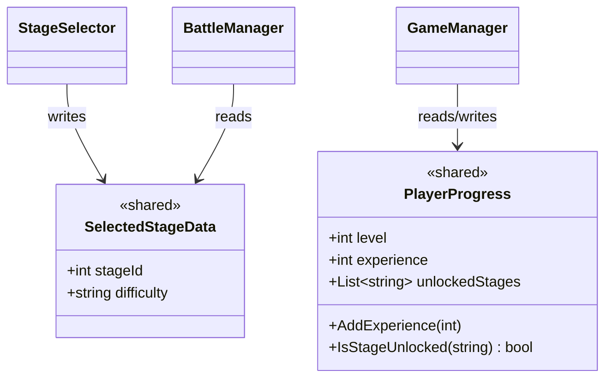
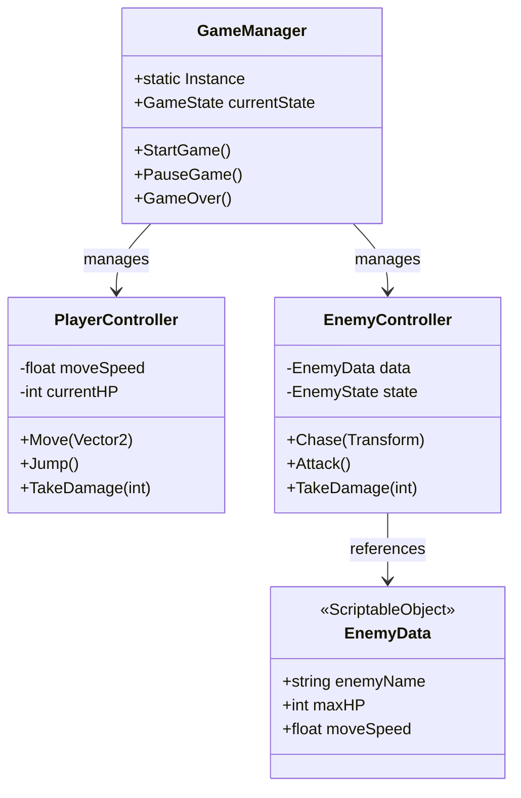
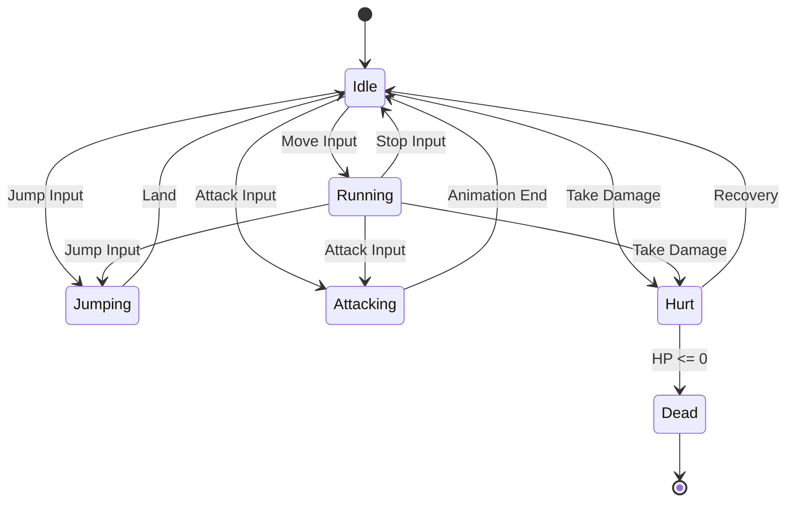
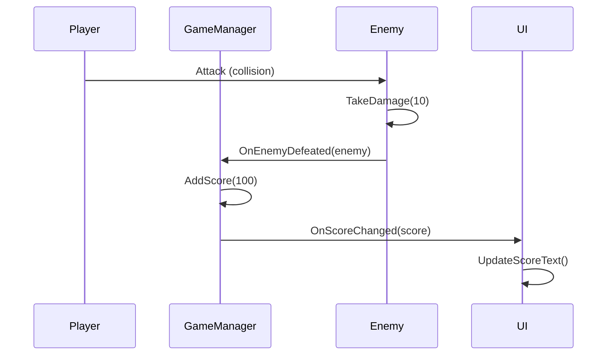
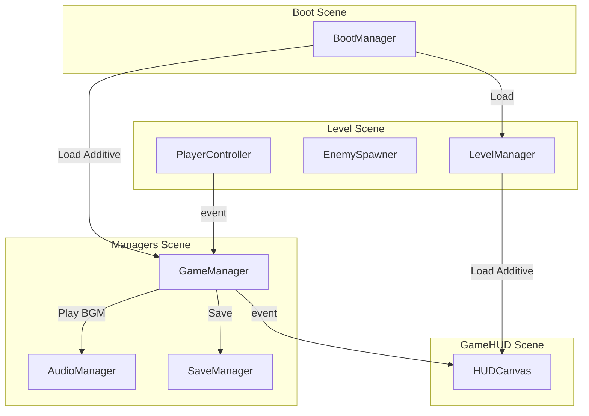
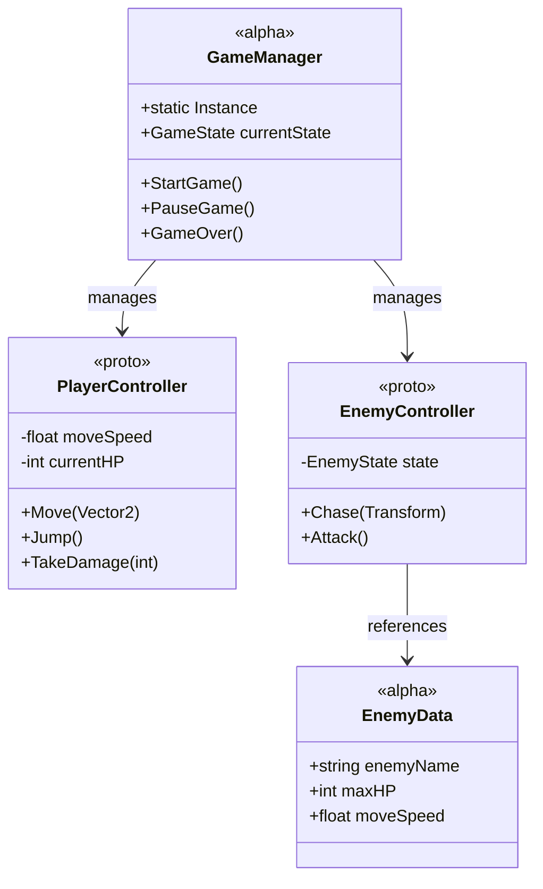
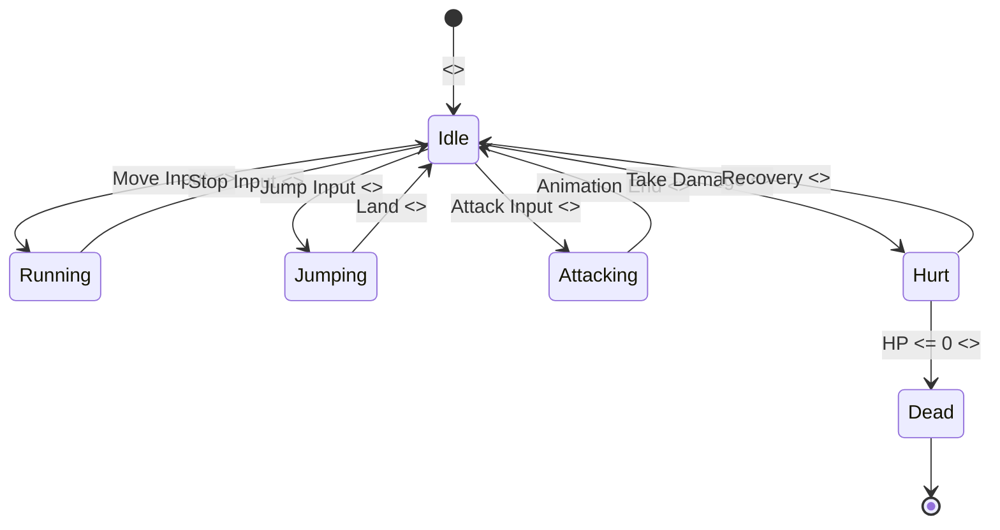
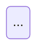

# 設計 ワークフローガイド (Unity-AI-Forge v{VERSION})

デザインパターン選定とUML設計。企画書の要件を技術設計に落とし込み、クラス構造・状態遷移・シーケンスを明確にするためのガイドです。

---

## 概要

設計フェーズの目的は「どう作るか」を技術的に明確にすることです。企画書で定義したメカニクス・シーン構成をもとに、適切なデザインパターンを選定し、UML図でクラス構造・状態遷移・通信フローを設計します。ここでの設計がプロトタイプ以降のコード品質を決定します。

**設計フェーズの原則:**
- 企画書のメカニクス一覧をもとにパターンを選定する
- Unity の特性（コンポーネント指向・SerializeField・ScriptableObject）を活かす
- 過度な抽象化を避け、必要最小限の設計にとどめる
- Mermaid 形式で UML を書き、プロジェクト内に保存する
- `class_dependency_graph` の概念を事前設計に反映する

---

## パイプライン位置

```
企画 → [設計] → プロジェクト初期設定 → プロトタイプ → アルファ → ベータ → リリース
```

**前提**: 企画書でコアループ・メカニクス・シーン構成・マイルストーンが定義済み（`game_workflow_guide(phase='planning')`）。企画書のメカニクス一覧と優先度をもとに、技術設計を行います。

---

## Unity 向け推奨デザインパターン

### Singleton (マネージャー系)

ゲーム全体で1つだけ存在するマネージャーに使用。`DontDestroyOnLoad` と併用。

```csharp
// GameManager, AudioManager, InputManager 等
public class GameManager : MonoBehaviour
{
    public static GameManager Instance { get; private set; }
    void Awake()
    {
        if (Instance != null) { Destroy(gameObject); return; }
        Instance = this;
        DontDestroyOnLoad(gameObject);
    }
}
```

**使いどころ**: GameManager, AudioManager, SaveManager
**注意**: 乱用するとグローバル状態が増えてテスト困難になる。本当に1つで良いものだけに使用。

### State Machine (状態遷移)

プレイヤー・敵・UI の状態管理に使用。

```csharp
// enum + switch / インターフェース + クラス のどちらでも可
public enum PlayerState { Idle, Running, Jumping, Attacking, Hurt, Dead }
```

**使いどころ**: PlayerController, EnemyAI, GameFlow, UIScreen遷移
**詳細**: `game_mechanics_guide(mechanic='state_machine')`

### Observer / Event (イベント駆動)

コンポーネント間の疎結合な通信に使用。C# の `event` / `Action` / Unity の `UnityEvent`。

```csharp
// C# event パターン
public static event Action<int> OnScoreChanged;
public static event Action<float> OnHealthChanged;

// Unity の UnityEvent はインスペクタからwiring可能
// → unity_event_wiring ツールで接続
```

**使いどころ**: HP変化通知, スコア更新, ゲーム状態変化, UI更新トリガー

#### ScriptableObject イベントチャネル（推奨）

C# event は直接参照が必要で、UnityEvent はシーンに閉じます。
ScriptableObject をイベントバスとして使う **Event Channel パターン** は
シーン横断・Inspector 可視・テスト容易の3点を同時に満たすため、Unity 公式推奨です。

```
EventChannel (ScriptableObject)
  +-- event Action<T> OnEventRaised
  +-- Raise(T value)

EventListener (MonoBehaviour)
  +-- channel: EventChannel    ← Inspector で SO アセットを接続
  +-- response: UnityEvent<T>  ← Inspector でレスポンスを接続
  +-- OnEnable() で登録 / OnDisable() で解除
```

チャネルアセットは `Assets/Data/Events/` に配置し、
`unity_scriptableObject_crud` で作成します。

**使い分け:**
- 同一 GameObject 内 → C# `event`
- 1対1のUI表示更新 → `unity_gamekit_ui(widgetType='binding')`
- 多対多のシステム間通知 → **SO Event Channel**
- Inspector で非プログラマーが接続 → **SO Event Channel** or `UnityEvent`

**詳細**: `game_mechanics_guide(mechanic='event_channel')`

### Command (コマンド)

入力→実行を分離。Undo/Redo、リプレイ、AIの行動キューに使用。

```csharp
public interface ICommand
{
    void Execute();
    void Undo();
}
```

**使いどころ**: ターン制RPGの行動選択, エディタツール, Undo機能

### Action Result (ロジック・演出分離)

ゲームロジックの計算結果を **ActionResult データ** として返し、演出層が消費するパターン。
ロジックと演出を分離することで、プロトタイプでは演出なしで動作確認し、
ベータフェーズで段階的に演出を追加できる。

```
Logic Layer (純粋な計算)              Presentation Layer (演出)
┌──────────────────┐                 ┌─────────────────────┐
│ CombatCalculator  │                 │ BattlePresenter      │
│                  │  ActionResult   │                     │
│ Execute(cmd)     │──────────────→│ Present(result)      │
│   → damage計算   │  {type, actor, │   → アニメーション再生 │
│   → 状態変化判定  │   target,      │   → VFX・SFX再生     │
│   → 勝敗判定     │   damage,      │   → ダメージ数字表示  │
│                  │   isCritical,  │   → 死亡演出         │
│                  │   targetDied}  │   → 次のResultへ     │
└──────────────────┘                 └─────────────────────┘
```

**フェーズ別実装との対応:**

```csharp
// ActionResult: ロジック層の出力データ
public struct ActionResult
{
    public ActionType type;       // Attack, Heal, Move, UseItem, etc.
    public GameObject actor;
    public GameObject target;
    public int value;             // ダメージ量・回復量
    public bool isCritical;
    public bool targetDefeated;
}
```

```
<<proto>>  ロジック層のみ実装。ActionResult を直接 Model に反映（演出なし）
           → HP即減算、死亡即削除、テキストログ出力のみ
<<alpha>>  簡易 Presenter を追加。ActionResult → 簡易テキスト表示 + 短いウェイト
           → ダメージ数字のUI表示、勝敗パネル表示
<<beta>>   本格 Presenter に差し替え。ActionResult → 演出キュー → 順番に再生
           → 攻撃アニメ → ヒットVFX → ダメージ数字 → 死亡演出 → カメラ演出
```

**キュー方式（ターン制向け）:**

複数の ActionResult を順番に演出する場合、キューで管理する。

```csharp
// Presenter がキューを消費して順番に演出
Queue<ActionResult> presentationQueue;

async UniTask PresentAll(List<ActionResult> results)
{
    foreach (var result in results)
    {
        await PlayAnimation(result);    // 攻撃モーション
        await PlayVFX(result);          // ヒットエフェクト
        await ShowDamageNumber(result);  // ダメージ数字
        if (result.targetDefeated)
            await PlayDeathSequence(result);
    }
}
```

**即時方式（リアルタイム向け）:**

リアルタイムアクションでは、ActionResult を即座に演出に変換する（キュー不要）。

```csharp
// ダメージ発生時に即座に演出
void OnDamageDealt(ActionResult result)
{
    SpawnDamageNumber(result.target, result.value, result.isCritical);
    PlayHitVFX(result.target.transform.position);
    PlayHitSFX(result.isCritical ? criticalClip : normalClip);
}
```

**UML 上の表記:**


```mermaid
classDiagram
    class ActionResult {
        <<data>>
        +ActionType type
        +int value
        +bool isCritical
        +bool targetDefeated
    }
    class CombatCalculator {
        <<proto>>
        +Execute(cmd) ActionResult
    }
    class BattlePresenter {
        <<beta>>
        +Present(ActionResult)
        -PlayAnimation()
        -PlayVFX()
        -ShowDamageNumber()
    }
    CombatCalculator ..> ActionResult : produces
    BattlePresenter ..> ActionResult : consumes
```

**適するジャンル:**
- ターン制RPG・SRPG（離散的なアクション → 演出キュー）
- カードゲーム（カード効果解決 → 演出キュー）
- リアルタイムアクション（ダメージ判定 → 即時演出）— キュー不要、即時方式で適用

**適さないケース:**
- 物理シミュレーション主体（物理エンジン自体が演出を兼ねる）
- ロジックと演出が本質的に不可分な場合

### Object Pool (オブジェクトプール)

頻繁に生成・破棄されるオブジェクト（弾, エフェクト）のGC負荷軽減。

```csharp
// Unity 2021+ の ObjectPool<T> を使用
// new ObjectPool<GameObject>(createFunc, actionOnGet, actionOnRelease, ...)
```

**使いどころ**: 弾, VFXパーティクル, 敵の大量スポーン
**備考**: Unity 2021+ では `UnityEngine.Pool.ObjectPool<T>` が標準提供されています。

### ScriptableObject (データ駆動)

ゲームデータをコードから分離。バランス調整・アセット管理に活用。

```csharp
[CreateAssetMenu(menuName = "MyGame/EnemyData")]
public class EnemyData : ScriptableObject
{
    public string enemyName;
    public int maxHP;
    public float moveSpeed;
    public float attackDamage;
}
```

**使いどころ**: 敵パラメータ, アイテムデータ, スキルテーブル, ゲーム設定
**MCPツール**: `unity_scriptableObject_crud(operation='create')`

### MVC/MVP for UI

UI とゲームロジックを分離する。Model(データ) - View(表示) - Controller/Presenter(仲介)。

```
Model (ScriptableObject/C# class) ← データ保持
  ↕ event通知
Presenter (MonoBehaviour) ← ロジック・仲介
  ↕ UI更新
View (UGUI/UI Toolkit) ← 表示のみ
```

**使いどころ**: HUD, インベントリ画面, ショップ画面
**MCPツール**: `unity_gamekit_ui(widgetType='binding')` がModel→View方向のバインディングを提供。

### シーン間共有モデルの設計

MVC の Model のうち、**シーンをまたいで共有するデータ**は設計段階で分離方針を決める。
static クラスによるグローバル状態はテスト困難・リセット漏れバグの温床になるため避ける。

| 用途 | 推奨パターン | MCPツール |
|------|------------|-----------|
| 少量の設定・選択データ（ステージID、難易度、パーティ編成等） | **DataContainer** (ScriptableObject) | `unity_gamekit_data(dataType='dataContainer', resetOnPlay=False)` |
| ロジック付きドメインモデル（セーブデータ、プレイヤー成長データ等） | カスタム ScriptableObject | `unity_scriptableObject_crud` |
| 変化通知が必要なデータ | EventChannel + DataContainer の組み合わせ | `unity_gamekit_data(dataType='eventChannel')` |

```
シーン間共有データの流れ:

StageSelect Scene                    Battle Scene
┌──────────────┐                    ┌──────────────┐
│ StageSelector │── write ──→ [DataContainer SO] ←── read ──│ BattleManager │
│ (MonoBehaviour)│           (Assets/Data/*.asset)           │ (MonoBehaviour)│
└──────────────┘                    └──────────────┘

※ 両シーンの MonoBehaviour が同じ SO アセットを SerializeField で参照
※ Inspector で値を確認・デバッグ可能
※ シーン単体テスト可能（SO をモックとしてセット可能）
```

**UML 上の表記**: シーン間共有の Model は `<<shared>>` ステレオタイプを付与し、
DataContainer か カスタム SO かを明記する。


```mermaid
classDiagram
    class SelectedStageData {
        <<shared>>
        <<DataContainer>>
        +int stageId
        +string difficulty
    }
    class PlayerProgress {
        <<shared>>
        <<ScriptableObject>>
        +int level
        +int experience
        +List~string~ unlockedStages
        +AddExperience(int)
        +IsStageUnlocked(string) bool
    }
    StageSelector --> SelectedStageData : writes
    BattleManager --> SelectedStageData : reads
    GameManager --> PlayerProgress : reads/writes
```

**注意点**:
- DataContainer は `resetOnPlay=False` でシーン遷移後もデータを保持する
- ロジック（メソッド）が必要なモデルは DataContainer ではなくカスタム SO にする
- DataContainer はコード生成されるため、生成後の手動編集は避ける

---

## Mermaid UML 設計ガイド

設計書はMermaid形式で記述し、プロジェクト内に保存します。

### クラス図


```mermaid
classDiagram
    class GameManager {
        +static Instance
        +GameState currentState
        +StartGame()
        +PauseGame()
        +GameOver()
    }
    class PlayerController {
        -float moveSpeed
        -int currentHP
        +Move(Vector2)
        +Jump()
        +TakeDamage(int)
    }
    class EnemyController {
        -EnemyData data
        -EnemyState state
        +Chase(Transform)
        +Attack()
        +TakeDamage(int)
    }
    class EnemyData {
        <<ScriptableObject>>
        +string enemyName
        +int maxHP
        +float moveSpeed
    }

    GameManager --> PlayerController : manages
    GameManager --> EnemyController : manages
    EnemyController --> EnemyData : references
```

### ステート図


```mermaid
stateDiagram-v2
    [*] --> Idle
    Idle --> Running : Move Input
    Running --> Idle : Stop Input
    Idle --> Jumping : Jump Input
    Running --> Jumping : Jump Input
    Jumping --> Idle : Land
    Idle --> Attacking : Attack Input
    Running --> Attacking : Attack Input
    Attacking --> Idle : Animation End
    Idle --> Hurt : Take Damage
    Running --> Hurt : Take Damage
    Hurt --> Idle : Recovery
    Hurt --> Dead : HP <= 0
    Dead --> [*]
```

### シーケンス図


```mermaid
sequenceDiagram
    participant Player
    participant GameManager
    participant Enemy
    participant UI

    Player->>Enemy: Attack (collision)
    Enemy->>Enemy: TakeDamage(10)
    Enemy->>GameManager: OnEnemyDefeated(enemy)
    GameManager->>GameManager: AddScore(100)
    GameManager->>UI: OnScoreChanged(score)
    UI->>UI: UpdateScoreText()
```

### コンポーネント図


```mermaid
graph TB
    subgraph Boot Scene
        BootManager
    end
    subgraph Managers Scene
        GameManager
        AudioManager
        SaveManager
    end
    subgraph GameHUD Scene
        HUDCanvas
    end
    subgraph Level Scene
        PlayerController
        EnemySpawner
        LevelManager
    end

    BootManager -->|Load Additive| GameManager
    BootManager -->|Load| LevelManager
    LevelManager -->|Load Additive| HUDCanvas
    PlayerController -->|event| GameManager
    GameManager -->|event| HUDCanvas
    GameManager -->|Save| SaveManager
    GameManager -->|Play BGM| AudioManager
```

---

## フェーズ別実装マッピング

UML設計は最終形を描くだけでなく、**どのフェーズで何を実装するか**を事前に決めることが重要です。企画書のマイルストーン定義（`game_workflow_guide(phase='planning')`）と対応させて、クラスや状態に実装フェーズを割り当てます。

### マッピングの原則

| フェーズ | 実装する範囲 | UML上のマーク |
|---------|------------|-------------|
| **プロトタイプ** | コアループに必要な最小クラス・状態のみ | `<<proto>>` |
| **アルファ** | ゲームロジック完成に必要なクラス・SO・イベント | `<<alpha>>` |
| **ベータ** | 演出・Presentation層のクラス | `<<beta>>` |

### フェーズ注釈付きクラス図の例


```mermaid
classDiagram
    class GameManager {
        <<alpha>>
        +static Instance
        +GameState currentState
        +StartGame()
        +PauseGame()
        +GameOver()
    }
    class PlayerController {
        <<proto>>
        -float moveSpeed
        -int currentHP
        +Move(Vector2)
        +Jump()
        +TakeDamage(int)
    }
    class EnemyController {
        <<proto>>
        -EnemyState state
        +Chase(Transform)
        +Attack()
    }
    class EnemyData {
        <<alpha>>
        <<ScriptableObject>>
        +string enemyName
        +int maxHP
        +float moveSpeed
    }

    GameManager --> PlayerController : manages
    GameManager --> EnemyController : manages
    EnemyController --> EnemyData : references
```

### フェーズ注釈付きステート図の例


```mermaid
stateDiagram-v2
    [*] --> Idle : <<proto>>
    Idle --> Running : Move Input <<proto>>
    Running --> Idle : Stop Input <<proto>>
    Idle --> Jumping : Jump Input <<proto>>
    Jumping --> Idle : Land <<proto>>
    Idle --> Attacking : Attack Input <<alpha>>
    Attacking --> Idle : Animation End <<alpha>>
    Idle --> Hurt : Take Damage <<alpha>>
    Hurt --> Idle : Recovery <<alpha>>
    Hurt --> Dead : HP <= 0 <<alpha>>
    Dead --> [*]
```

### マッピング手順

1. **クラス図の全クラスに `<<proto>>` / `<<alpha>>` / `<<beta>>` を付与**する
2. **ステート図の遷移にフェーズを注釈**する（プロトタイプでは最小限の遷移のみ実装）
3. **シーケンス図でプロトタイプ範囲を明示**する（ハードコード値で動かす部分 vs SO化する部分）
4. **企画書のマイルストーン検証基準と照合**する

### 注意点

- プロトタイプで `<<proto>>` 以外のクラスを実装しない。過剰設計を防ぐ
- `<<alpha>>` のクラスで `<<proto>>` のクラスを置き換える場合がある（例: ハードコード PlayerProto → SO参照の PlayerController）
- `<<beta>>` のクラスは演出層（マテリアル・アニメーション・ライティング等）のため、設計時は接続先のみ定義すれば十分

---

## 設計ドキュメントの保存

```python
# クラス図を含む設計ドキュメントを保存
unity_asset_crud(operation='create',
    assetPath='Assets/Documents/ClassDiagram.md',
    content='''# クラス設計

## クラス図
```mermaid
classDiagram
    ...
```

## 状態遷移図

```mermaid
stateDiagram-v2
    ...
```
''')
```

---

## Unity 標準パッケージ選定ガイド

プロジェクトで使用するパッケージを設計段階で決定します。

| パッケージ | 用途 | 推奨条件 |
|-----------|------|---------|
| Input System | 入力管理 | 全プロジェクトで推奨 |
| TextMeshPro | テキスト描画 | 全プロジェクトで推奨 |
| Cinemachine | カメラ制御 | 3D / 複雑なカメラワーク |
| 2D Tilemap | タイルマップ | 2Dゲーム |
| 2D Animation | ボーンアニメーション | 2Dキャラクター |
| Addressables | アセット管理 | 大規模プロジェクト |
| Universal RP | レンダリング | 2D/3Dマルチ、モバイル |

---

## チェックリスト

### パターン選定
- [ ] 企画書のメカニクス一覧から必要なパターンを特定した
- [ ] Singleton を使うマネージャーを列挙した
- [ ] State Machine で管理する対象を列挙した
- [ ] イベント（Observer）で通知する変化を列挙した
- [ ] ScriptableObject で管理するデータを列挙した
- [ ] Action Result パターンの適用箇所を特定した（ロジック・演出分離が必要な処理）

### シーン間共有データ
- [ ] シーン間で共有する Model を洗い出した
- [ ] 各共有データに DataContainer / カスタムSO / EventChannel のパターンを割り当てた
- [ ] static クラスによるグローバル状態がないことを確認した

### UML図
- [ ] クラス図を作成した（主要クラスとその関係）
- [ ] シーン間共有モデルに `<<shared>>` ステレオタイプを付与した
- [ ] ステート図を作成した（プレイヤー/敵/ゲーム状態）
- [ ] シーケンス図を作成した（主要なインタラクション）
- [ ] コンポーネント図を作成した（シーン間関係）

### フェーズ別実装マッピング
- [ ] 全クラスに `<<proto>>` / `<<alpha>>` / `<<beta>>` のフェーズ注釈を付与した
- [ ] ステート図の遷移にプロトタイプ範囲を明示した
- [ ] 企画書のマイルストーン検証基準と照合した

### パッケージ
- [ ] 使用するUnityパッケージを決定した
- [ ] パッケージの依存関係を確認した

### ドキュメント
- [ ] 設計ドキュメントをプロジェクト内に保存した
- [ ] 企画書との対応関係を明記した

---

## 次のフェーズへ

設計が完了したら、以下の順序で進みます:

1. **プロジェクト初期設定** (`game_workflow_guide(phase='project_setup')`) - タグ・レイヤー・フォルダ構造の実装
2. **プロトタイプ** (`game_workflow_guide(phase='prototype')`) - コアループの動作検証

フェーズ別実装マッピングで `<<proto>>` を付与したクラス・状態のみをプロトタイプで実装し、`<<alpha>>` のクラスはアルファフェーズで正式なアーキテクチャとして実装します。`<<beta>>` の演出クラスはベータフェーズで Mid-Level ツールを使って追加します。

---

## 関連ツール一覧

| ツール | 設計フェーズでの用途 |
|--------|-------------------|
| `unity_asset_crud` | 設計ドキュメントの保存 |
| `unity_class_dependency_graph` | 既存コードの依存関係調査（リファクタリング時） |
| `unity_class_catalog` | 既存クラスの一覧確認 |
| `unity_gamekit_data(dataType='dataContainer')` | シーン間共有データの実装 |
| `unity_gamekit_data(dataType='eventChannel')` | システム間イベント通知の実装 |
| `game_genre_guide` | ジャンル別推奨パターンの参照 |
| `game_mechanics_guide` | メカニクス実装パターンの参照 |
