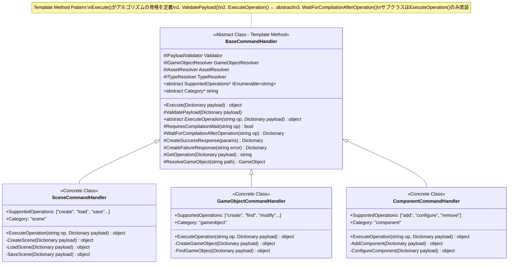

# Unity-AI-Forge UML図（デザインパターン版）

## 1. 全体アーキテクチャ概要

---

## 2. Singleton + Facade Pattern: McpBridgeService

WebSocket通信の複雑さを隠蔽し、単一のアクセスポイントを提供

---

## 3. Factory Pattern: CommandHandlerFactory

ハンドラーの生成・登録・取得を一元管理

---

## 4. Strategy Pattern: ICommandHandler

操作の実行方法を交換可能なアルゴリズムとしてカプセル化

---

## 5. Template Method Pattern: BaseCommandHandler

アルゴリズムの骨格を定義し、サブクラスで具体的な処理を実装

**Template Method 実行フロー：**

---

## 6. Observer Pattern: UnityEvent System

イベント発生時に購読者へ自動通知

---

## 7. Registry Pattern: Component Lookup

IDによるコンポーネントの高速検索を提供

---

## 8. Abstract Factory Pattern: GameKitManager

ManagerTypeに応じて関連するコンポーネント群を生成

---

## 9. Strategy Pattern: BehaviorProfile (Movement System)

移動方式を交換可能なアルゴリズムとして実装

---

## 10. Mediator Pattern: McpCommandProcessor

ハンドラー間の直接依存を排除し、中央で調整

---

## 11. Dependency Injection: Resource Resolvers

依存性を外部から注入し、テスタビリティを向上

---

## 12. Prototype Pattern: ScriptableObject Assets

既存オブジェクトをコピーして新インスタンスを生成

---

## 13. Command Pattern: MCP Tool Execution

リクエストをオブジェクトとしてカプセル化

---

## 14. Composite Pattern: Scene Hierarchy

ツリー構造でGameObjectを統一的に扱う

---

## 15. State Pattern: GameKitSceneFlow

シーン状態に応じて振る舞いを変更

---

## 16. 完全なコマンド実行シーケンス（パターン適用）

---

## デザインパターン一覧

| パターン | 分類 | 適用箇所 | 目的 |
|----------|------|----------|------|
| **Singleton** | 生成 | McpBridgeService | 単一のWebSocket接続管理 |
| **Factory** | 生成 | CommandHandlerFactory | ハンドラーの動的生成・取得 |
| **Abstract Factory** | 生成 | GameKitManager | Manager種別に応じたコンポーネント群生成 |
| **Prototype** | 生成 | ScriptableObject Assets | テンプレートからの複製生成 |
| **Facade** | 構造 | McpBridgeService | WebSocket通信の複雑性隠蔽 |
| **Composite** | 構造 | Scene Hierarchy | ツリー構造の統一操作 |
| **Strategy** | 振舞 | ICommandHandler, BehaviorProfile | アルゴリズムの交換可能性 |
| **Template Method** | 振舞 | BaseCommandHandler | 処理フローの骨格定義 |
| **Observer** | 振舞 | UnityEvent System | イベント駆動の疎結合通知 |
| **Mediator** | 振舞 | McpCommandProcessor | ハンドラー間調整 |
| **Command** | 振舞 | McpIncomingCommand | リクエストのオブジェクト化 |
| **State** | 振舞 | GameKitSceneFlow | 状態に応じた振る舞い変更 |
| **Registry** | その他 | GameKitHealth, GameKitInventory | IDによる高速検索 |
| **DI** | その他 | BaseCommandHandler | 依存性の外部注入 |
